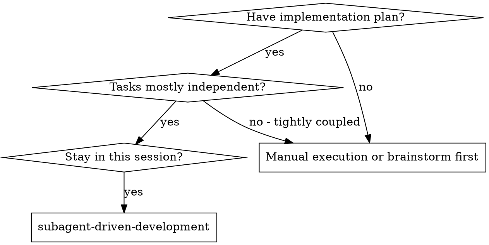

# Subagent-Driven Development

Execute plan by dispatching a fresh programmer per task, with spec-compliance review followed by code-quality review. Commit approved tasks at plan-defined atomic boundaries.

**Core principle:** Fresh programmer per task + two-stage task review + controller-owned atomic commits = high quality, atomic history

## When to Use


## The Process

```dot
digraph process {
    rankdir=TB;

    subgraph cluster_per_task {
        label="Per Task";
        "Dispatch programmer subagent (./programmer-prompt.md)" [shape=box];
        "programmer reports NEEDS_CONTEXT?" [shape=diamond];
        "Resolve from authoritative context or ask human" [shape=box];
        "programmer subagent implements, tests, self-reviews" [shape=box];
        "Dispatch spec reviewer subagent (./spec-reviewer-prompt.md)" [shape=box];
        "Spec reviewer subagent confirms code matches spec?" [shape=diamond];
        "programmer subagent fixes spec gaps" [shape=box];
        "Dispatch code reviewer using requesting-code-review/code-reviewer.md" [shape=box];
        "Code quality reviewer approves task?" [shape=diamond];
        "programmer subagent fixes quality issues" [shape=box];
        "Controller stages task's planned paths" [shape=box];
        "Mark task complete in TodoWrite" [shape=box];
        "Atomic commit boundary reached?" [shape=diamond];
        "Controller verifies, inspects, and commits staged group" [shape=box];
    }

    "Read plan, extract all tasks with full text, note context, create TodoWrite" [shape=box];
    "More tasks remain?" [shape=diamond];
    "Dispatch final code reviewer subagent for entire implementation" [shape=box];

    "Read plan, extract all tasks with full text, note context, create TodoWrite" -> "Dispatch programmer subagent (./programmer-prompt.md)";
    "Dispatch programmer subagent (./programmer-prompt.md)" -> "programmer reports NEEDS_CONTEXT?";
    "programmer reports NEEDS_CONTEXT?" -> "Resolve from authoritative context or ask human" [label="yes"];
    "Resolve from authoritative context or ask human" -> "Dispatch programmer subagent (./programmer-prompt.md)" [label="resume same programmer"];
    "programmer reports NEEDS_CONTEXT?" -> "programmer subagent implements, tests, self-reviews" [label="no"];
    "programmer subagent implements, tests, self-reviews" -> "Dispatch code-reviewer subagent for spec review(./spec-reviewer-prompt.md)";
    "Dispatch code-reviewer subagent for spec review(./spec-reviewer-prompt.md)" -> "Spec review confirms code matches spec?";
    "Spec review confirms code matches spec?" -> "programmer subagent fixes spec gaps" [label="no"];
    "programmer subagent fixes spec gaps" -> "Redispatch the same spec reviewer subagent (./spec-reviewer-prompt.md)" [label="re-review"];
    "Spec review confirms code matches spec?" -> "Dispatch code reviewer using requesting-code-review/code-reviewer.md" [label="yes"];
    "Dispatch code reviewer using requesting-code-review/code-reviewer.md" -> "Code quality review approves task?";
    "Code quality review approves task?" -> "programmer subagent fixes quality issues" [label="no"];
    "programmer subagent fixes quality issues" -> "Redispatch the same code reviewer using requesting-code-review/code-reviewer.md" [label="resume same reviewer"];
    "Code quality reviewer approves task?" -> "Controller stages task's planned paths" [label="yes"];
    "Controller stages task's planned paths" -> "Mark task complete in TodoWrite";
    "Mark task complete in TodoWrite" -> "Atomic commit boundary reached?";
    "Atomic commit boundary reached?" -> "Controller verifies, inspects, and commits staged group" [label="yes"];
    "Atomic commit boundary reached?" -> "More tasks remain?" [label="no"];
    "Controller verifies, inspects, and commits staged group" -> "More tasks remain?";
    "More tasks remain?" -> "Dispatch programmer subagent (./programmer-prompt.md)" [label="yes"];
    "More tasks remain?" -> "Dispatch final code reviewer subagent for entire implementation" [label="no"];
}
```



## Handling programmer Status

programmer subagents report one of four statuses. Handle each appropriately:

**DONE:** Proceed to spec compliance review.

**DONE_WITH_CONCERNS:** The programmer completed the work but flagged doubts. Read the concerns before proceeding. If the concerns are about correctness or scope, address them before review. If they're observations (e.g., "this file is getting large"), note them and proceed to review.

**NEEDS_CONTEXT:** The programmer needs information that wasn't provided. First resolve it from authoritative existing context if possible. Otherwise ask the human the programmer's exact question. Then provide only the resolution and resume the same programmer; do not dispatch a fresh programmer or begin review.

**BLOCKED:** The programmer cannot complete the task. Assess the blocker:
1. If it's a context problem, resolve it or ask the human, then resume the same programmer
2. If the task requires more reasoning, re-dispatch with a more capable model
3. If the task is too large, break it into smaller pieces
4. If the plan itself is wrong, escalate to the human

**Never** ignore an escalation or force the same model to retry without changes. If the programmer said it's stuck, something needs to change.

## Context-Efficient Dispatch

- Give the programmer the complete current task, relevant global constraints,
  and only the interfaces or decisions from earlier tasks that it needs.
- Do not paste accumulated prior-task summaries or unrelated session history.
- Record the programmer's agent identity from the dispatch result. Resume the
  same programmer for fix rounds and `NEEDS_CONTEXT` continuations.
- Never dispatch multiple implementation subagents in parallel (conflicts).

## Task Review and Atomic Commits

Before dispatching a task, confirm its planned paths contain no unrelated
unstaged changes. If they do, stop and ask the human rather than mixing them
into the task.

After spec compliance passes, dispatch the `code-reviewer` subagent with
`requesting-code-review/code-reviewer.md`:

- `[DESCRIPTION]`: the programmer's task summary
- `[PLAN_OR_REQUIREMENTS]`: the full current task text
- `[REVIEW_TARGET]`: `unstaged implementation for Task N`
- `[DIFF_COMMANDS]`: `git status --short -- [task paths]; git diff -- [task paths]`

The reviewer may run verification but remains read-only. It reviews the current
task's unstaged diff and reads new untracked task files reported by `git status`.

If it finds issues, resume the same programmer. Rerun spec review first when a
fix may affect compliance, then resume the same code reviewer over the complete
task scope. Repeat until both reviews approve.

After both reviews approve, stage only that task's planned paths. Do not commit
yet.

The plan defines atomic commit groups containing one or more approved tasks.
When a boundary is reached, the controller:

1. Confirms every included task passed both reviews and is staged.
2. Runs the group's fresh verification command.
3. Inspects status and the complete staged diff for unrelated changes and secrets.
4. Commits using the plan's subject.

If group verification modifies or invalidates code, do not commit. Fix the
affected task, repeat both task reviews, stage it again, and rerun group
verification.

Programmers never commit. Never commit before a boundary, split one task across
commits, include unrelated changes, or leave review fixes for a later commit.

## Prompt Templates

- `./programmer-prompt.md` - Dispatch programmer subagent
- `./spec-reviewer-prompt.md` - Dispatch spec compliance reviewer subagent
- `../requesting-code-review/code-reviewer.md` - Dispatch per-task code-quality reviewer

## Example Workflow

```
You: I'm using Subagent-Driven Development to execute this plan.

[Read plan file once: .opencode/plans/feature-plan.md]
[Extract all 5 tasks with full text and context]
[Create TodoWrite with all tasks]

Task 1: Hook installation script

[Get Task 1 text and context (already extracted)]
[Dispatch implementation subagent with full task text + context]

[Programmer reports NEEDS_CONTEXT: "Should the hook be installed at user or system level?"]
[Ask human because the plan and codebase do not resolve it]
[Resume the same programmer with: "User level (~/.config/superpowers/hooks/)" ]
[Later] programmer:
  - Implemented install-hook command
  - Added tests, 5/5 passing
  - Self-review: Found I missed --force flag, added it
  - Ready for controller review

[Dispatch spec compliance reviewer]
Spec reviewer: ✅ Spec compliant - all requirements met, nothing extra

[Dispatch code reviewer over Task 1's unstaged changes]
Code reviewer: Strengths: Good test coverage, clean. Issues: None. Approved.

[Controller stages only Task 1's planned paths]
[Mark Task 1 complete]
[Task 1 closes Commit 1 boundary]
[Controller verifies the complete staged group]
[Controller inspects staged diff/status/secrets and commits]

Task 2: Recovery modes

[Get Task 2 text and context (already extracted)]
[Dispatch implementation subagent with full task text + context]

programmer: [No questions, proceeds]
programmer:
  - Added verify/repair modes
  - 8/8 tests passing
  - Self-review: All good
  - Ready for controller review

[Dispatch spec compliance reviewer]
Spec reviewer: ❌ Issues:
  - Missing: Progress reporting (spec says "report every 100 items")
  - Extra: Added --json flag (not requested)

[programmer fixes issues]
programmer: Removed --json flag, added progress reporting

[Spec reviewer reviews again]
Spec reviewer: ✅ Spec compliant now

[Dispatch code reviewer over Task 2's unstaged changes]
Code reviewer: Strengths: Solid. Issues (Important): Magic number (100)

[Resume Task 2 programmer with finding]
programmer: Extracted PROGRESS_INTERVAL constant

[Resume same code reviewer for complete Task 2 re-review]
Code reviewer: ✅ Approved

[Controller stages only Task 2's planned paths]
[Mark Task 2 complete]
[Task 2 closes Commit 2 boundary]
[Controller verifies the complete staged group]
[Controller inspects staged diff/status/secrets and commits]

...

[After all tasks]
[Dispatch final code-reviewer]
Final reviewer: All requirements met, ready to merge

Done!
```

## Advantages

**vs. Manual execution:**
- Subagents follow TDD naturally
- Fresh context per task (no confusion)
- Parallel-safe (subagents don't interfere)
- Missing context is surfaced explicitly before or during work

**vs. Executing Plans:**
- Same session (no handoff)
- Continuous progress (no waiting)
- Review checkpoints automatic

**Efficiency gains:**
- No file reading overhead (controller provides full text)
- Controller curates exactly what context is needed
- Subagent gets complete information upfront
- Missing context is surfaced instead of guessed

**Quality gates:**
- Self-review catches issues before handoff
- Two-stage task review: spec compliance, then code quality
- Review loops ensure fixes actually work
- Spec compliance prevents over/under-building
- Code quality ensures implementation is well-built

**Cost:**
- More subagent invocations (programmer + spec reviewer + quality reviewer per task)
- Controller does more prep work (extracting all tasks upfront)
- Review loops add iterations
- But catches issues early (cheaper than debugging later)

## Red Flags

**Never:**
- Start implementation on main/master branch without explicit user consent
- Skip reviews (spec compliance OR code quality)
- Proceed with unfixed issues
- Dispatch multiple implementation subagents in parallel (conflicts)
- Make subagent read plan file (provide full text instead)
- Skip scene-setting context (subagent needs to understand where task fits)
- Ignore `NEEDS_CONTEXT` or start review before resolving it
- Accept "close enough" on spec compliance (spec reviewer found issues = not done)
- Skip review loops (reviewer found issues = programmer fixes = review again)
- Let programmer self-review replace actual review (both are needed)
- **Start code quality review before spec compliance is ✅** (wrong order)
- Move to the next task while either task review has open issues
- Let a programmer commit or commit before an atomic boundary is fully reviewed and verified

**If subagent reports `NEEDS_CONTEXT`:**
- Resolve from authoritative existing context when possible
- Otherwise ask the human the exact question
- Resume the same programmer with only the resolution and relevant context
- Do not start review or dispatch a fresh programmer

**If reviewer finds issues:**
- programmer (same subagent) fixes them
- Reviewer reviews again
- Repeat until approved
- Don't skip the re-review

**If subagent fails task:**
- Dispatch fix subagent with specific instructions
- Don't try to fix manually (context pollution)

## Integration

**Required workflow skills:**
- **writing-plans** - Creates the plan this skill executes
- **requesting-code-review** - Code review template for reviewer subagents

**Subagents should use:**
- **test-driven-development** - Subagents follow TDD for each task
