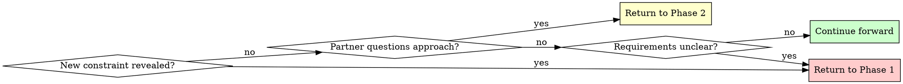

# Brainstorming Ideas Into Designs

## Overview

Transform rough ideas into fully-formed designs through structured questioning and alternative exploration.

**Core principle:** Research first, ask targeted questions to fill gaps, explore alternatives, present design incrementally for validation.

**Announce at start:** "I'm using the brainstorming skill to refine your idea into a design."

## Quick Reference

| Phase                       | Key Activities                                | Tool Usage                            | Output                                     |
| --------------------------- | --------------------------------------------- | ------------------------------------- | ------------------------------------------ |
| **Prep: Autonomous Recon**  | Inspect repo/docs/commits, form initial model | Native tools (ls, cat, git log, etc.) | Draft understanding to confirm             |
| **1. Understanding**        | Share findings, ask only for missing context  | Ask user questions for real decisions | Purpose, constraints, criteria (confirmed) |
| **2. Exploration**          | Propose 2-3 approaches                        | session to explore multiple ideas     | Architecture options with trade-offs       |
| **3. Design Presentation**  | Present in 200-300 word sections              | Open-ended questions                  | Complete design with validation            |
| **4. Design Documentation** | Write design document                         | writing-clearly-and-concisely skill   | Design doc in docs/plans/                  |
| **6. Planning Handoff**     | Create implementation plan                    | writing-plans skill                   | Detailed task breakdown                    |

## The Process

You MUST use the todowrite/todoread tools to track your progress through this process. Copy this checklist:

```
Brainstorming Progress:
- [ ] Prep: Autonomous Recon (repo/docs/commits reviewed, initial model shared)
- [ ] Phase 1: Understanding (purpose, constraints, criteria gathered)
- [ ] Phase 2: Exploration (2-3 approaches proposed and evaluated)
- [ ] Phase 3: Design Presentation (design validated in sections)
- [ ] Phase 4: Design Documentation (design written to docs/plans/)
- [ ] Phase 5: Planning Handoff (if implementing)
```

### Prep: Autonomous Recon

- Use existing tools (file browsing, docs, git history, tests) to understand current project state before asking anything.
- Form your draft model: what problem you're solving, what artifacts exist, and what questions remain.
- Start the conversation by sharing that model: "Based on exploring the project state, docs, working copy, and recent commits, here's how I think this should work…"
- Ask follow-up questions only for information you cannot infer from available materials.

### Phase 1: Understanding

- Share your synthesized understanding first, then invite corrections or additions.
- Ask one focused question at a time, only for gaps you cannot close yourself.
- Gather: Purpose, constraints, success criteria (confirmed or amended by your partner)

**Example summary + targeted question:**

```
Based on the README and yesterday's commit, we're expanding localization to dashboard and billing emails; admin console is still untouched. Only gap I see is whether support responses need localization in this iteration. Did I miss anything important?
```

### Phase 2: Exploration

- Propose 2-3 different approaches
- For each: Core architecture, trade-offs, complexity assessment, and your recommendation
- Ask the user questions to present approaches when you truly need a judgement call
- Lead with the option you prefer and explain why; invite disagreement if your partner sees it differently
- Own prioritization: if the repo makes priorities clear, state them and proceed rather than asking

\*_Example of asking the user questions_

```
Question: "Which architectural approach should we use?"
Options:
  - "Direct API calls with retry logic" (simple, synchronous, easier to debug) ← recommended for current scope
  - "Event-driven with message queue" (scalable, complex setup, eventual consistency)
  - "Hybrid with background jobs" (balanced, moderate complexity, best of both)

I recommend the direct API approach because it matches existing patterns and minimizes new infrastructure. Let me know if you see a blocker that pushes us toward the other options.
```

### Phase 3: Design Presentation

- Present in coherent sections; use ~200-300 words when introducing new material, shorter summaries once alignment is obvious
- Cover: Architecture, components, data flow, error handling, testing
- Check in at natural breakpoints rather than after every paragraph: "Stop me if this diverges from what you expect."
- Use open-ended questions to allow freeform feedback
- Assume ownership and proceed unless your partner redirects you

### Phase 4: Design Documentation

After validating the design, write it to a permanent document:

- **File location:** `docs/plans/YYYY-MM-DD-<topic>-design.md` (use actual date and descriptive topic)
- **Content:** Capture the design as discussed and validated in Phase 3, organized into sections that emerged from the conversation
- Commit the design document to git before proceeding

### Phase 5: Planning Handoff

Ask: "Ready to create the implementation plan?"

When your human partner confirms (any affirmative response):

- Announce: "I'm starting a new session with the writing-plans skill to create the implementation plan."
- **REQUIRED TOOL USE:** use the `session` tool to make a new session with the current agent type.
- Message for new session should be:
  > "Before you do anything else, you MUST use the skills_writing_plans tool first. Then, read the design document @{PATH TO DESIGN DOC}"
- Be sure to substitute in the correct path to the design doc created in phase 4

## When to Use Open-Ended Questions

**Use open-ended questions for:**

- Phase 3: Design validation ("Does this look right so far?")
- When you need detailed feedback or explanation
- When partner should describe their own requirements
- When structured options would limit creative input

Frame them to confirm or expand your current understanding rather than reopening settled topics.

**Example decision flow:**

- "What authentication method?" → Use AskUserQuestion (2-4 options)
- "Does this design handle your use case?" → Open-ended (validation)

## When to Revisit Earlier Phases



**You can and should go backward when:**

- Partner reveals new constraint during Phase 2 or 3 → Return to Phase 1
- Validation shows fundamental gap in requirements → Return to Phase 1
- Partner questions approach during Phase 3 → Return to Phase 2
- Something doesn't make sense → Go back and clarify

**Avoid forcing forward linearly** when going backward would give better results.

## Key Principles

| Principle                  | Application                                                                                    |
| -------------------------- | ---------------------------------------------------------------------------------------------- |
| **One question at a time** | Phase 1: Single targeted question only for gaps you can’t close yourself                       |
| **Structured choices**     | Use AskUserQuestion tool for 2-4 options with trade-offs                                       |
| **YAGNI ruthlessly**       | Remove unnecessary features from all designs                                                   |
| **Explore alternatives**   | Always propose 2-3 approaches before settling                                                  |
| **Incremental validation** | Present design in sections, validate each                                                      |
| **Flexible progression**   | Go backward when needed - flexibility > rigidity                                               |
| **Own the initiative**     | Recommend priorities and next steps; ask if you should proceed only when requirements conflict |
| **Announce usage**         | State skill usage at start of session                                                          |
